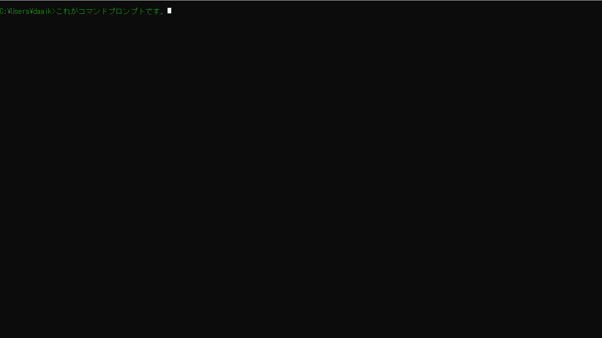
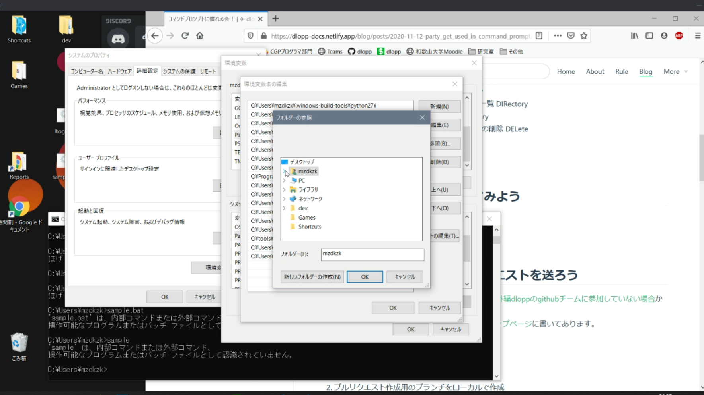
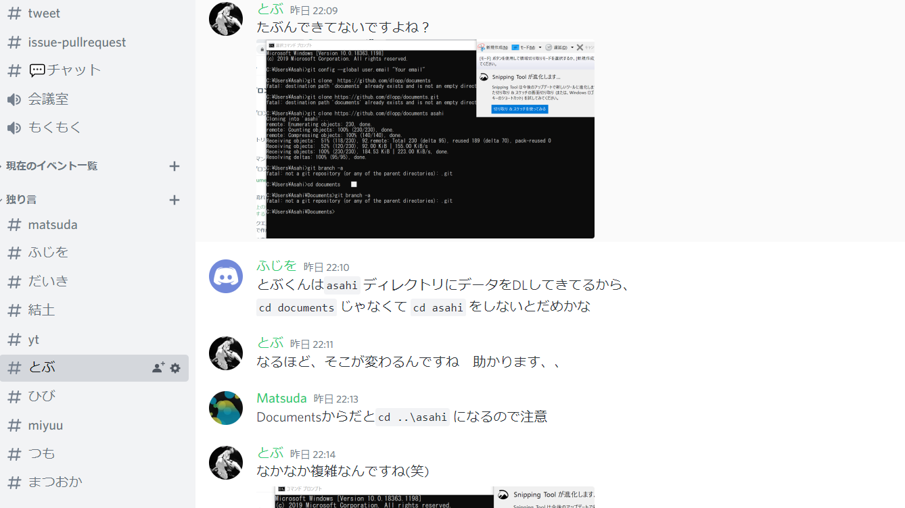
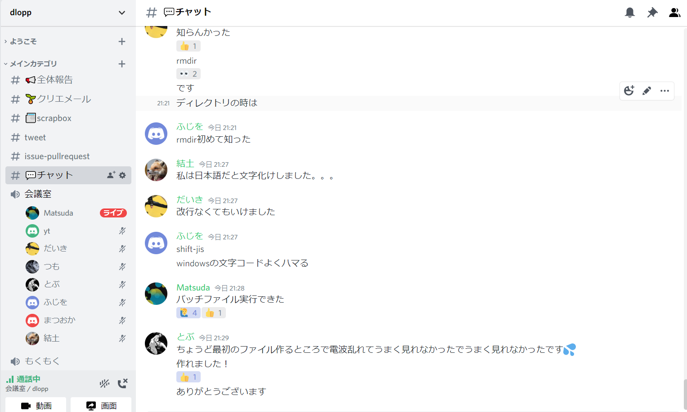
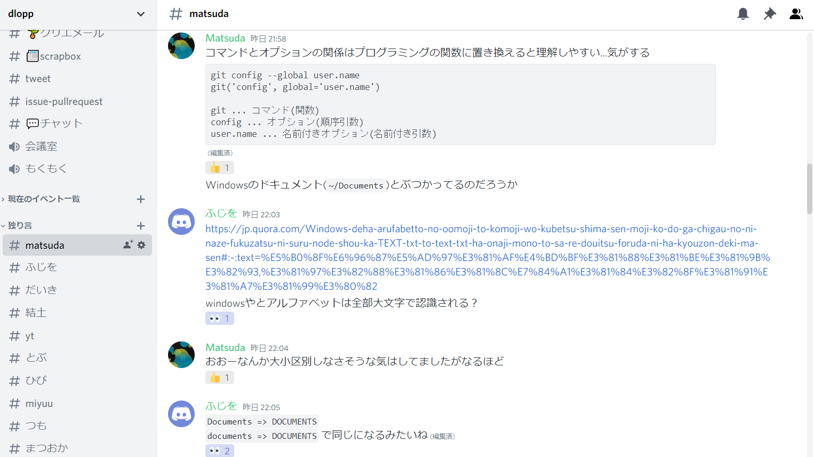
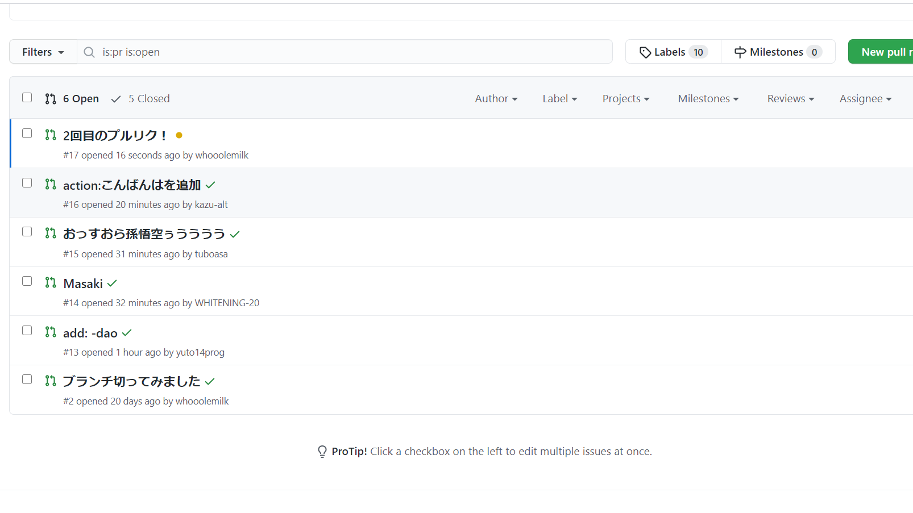

# コマンドプロンプトに慣れる会   イベントレポート#1

こんにちはー！ dlopp運営のDaiki[(@Daaiki2323)](https://twitter.com/Daaiki2323)です。  
11/29にコマンドプロンプト勉強会(初心者向け)を完全オンラインで開催しました！  
今回は、それのイベントレポートです。  
勉強会で利用した資料は[こちら](./コマンドプロンプトに慣れる会.md)

### コマンドプロンプトとは
その見た目から嫌煙されがちなこれです。pcと直接会話できるという代物。
 

 

## タイムスケジュール 
 

| 時間 | 内容 |
| ---- | ---- |
| 21:00 | 挨拶 |
| 21:05 | MAZDA バッチファイルにパスを通してみよう |
| 21:30 | Daiki プルリクエストを送ってみよう |
| 23:00 | 終わり |

## バッチファイルにパスを通してみよう
B3のMAZDAさん[(@radio69chief)](https://twitter.com/radio69chief)に講義していただきました。  

パスを通しているところ↓
 

## プルリクエストを送ってみよう
これは、僕[(@Daaiki2323)](https://twitter.com/Daaiki2323)が担当しました。  
プルリクエストとは何か、その仕組み、どういうときに送るのか、を説明した後、実際に送って見ようという流れで行いました。  
dloppでは、issueとプルリクエストの通知をすべてdiscordに流すようにしているので、プルリクエストへの理解はめっちゃ早かった気がしました。

## 勉強会の様子
詰まってる人に有識者が個別で対応している様子 
 

 
勉強会中のチャットの様子
 

 
プルリクエストを送ってもらった記念写真
 

## さいごに
今回参加して下さったメンバー、MAZDAさん、有難うございました！ 
dloppでは、勉強会以外にも、LT会や内部ハッカソンなどのイベントを開こうと思ってます！そのほか、外部イベントにも参加していきたいと思います。  
普段は、好きに開発をして詰まった所を質問したりコードレビューもらったり、便利なツールを共有したりしています。  
dloppに興味を持って下さった方は、twitter[(@wucrea_dlopp)](https://twitter.com/wucrea_dlopp)からメッセージお待ちしております！
[aboutページ](../../about/index.md)も是非ご覧ください。