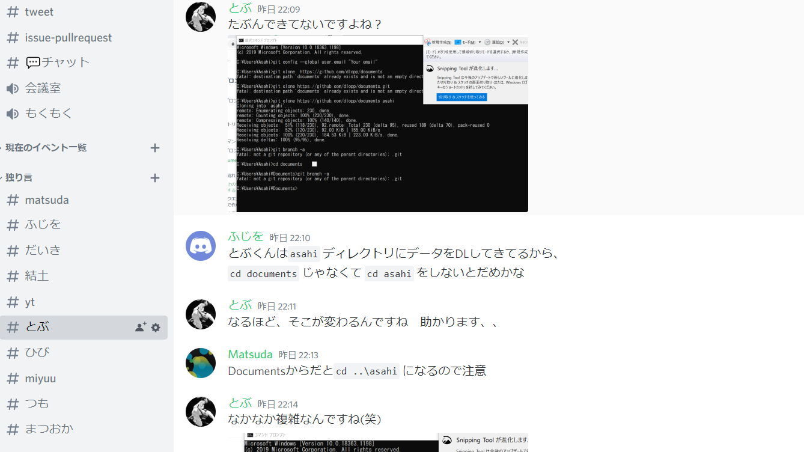
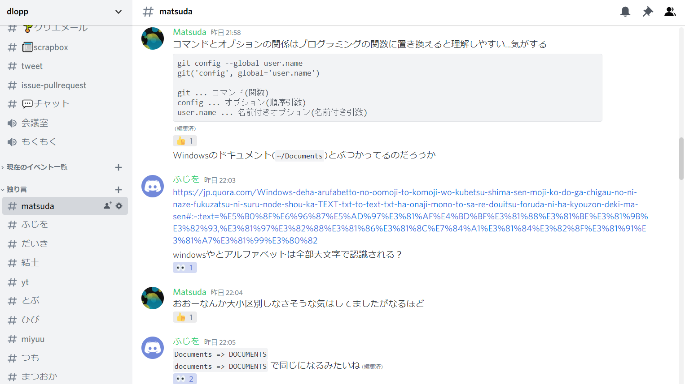

# 冬休みLT会   イベントレポート#2

明けましておめでとうございます！2021年1発目の記事は去年12/27(日)に行われた、冬休みLT会のイベントレポートです。  
dlopp運営の結土[(@yuto_wu)](https://twitter.com/yuto_wu)がお送りします！

### LT会って何？
LTとは　"Lightning Talks"　の略で、「稲妻のような短時間でなにか話してみよう！」というものです。  
簡単に言うと、短時間のプレゼンみたいなものですが、特にルールはありません。自分が思っていることや話したいことをまとめて話すという非常にシンプルなものなのです。
 

## 今回のテーマ
 

「最近やったこと」が今回のテーマでした。プログラミングに限らず何でも良し！です。メンバーが何をやっているのかを知るいい機会でしたので、親睦会みたいな雰囲気でした。

## タイムスケジュール
 

| 時間 | 内容 |
| ---- | ---- |
| 21:00 | 挨拶 |
| 21:05 | MAZDA バッチファイルにパスを通してみよう |
| 21:30 | Daiki プルリクエストを送ってみよう |
| 23:00 | 終わり |

## バッチファイルにパスを通してみよう
B3のMAZDAさん[(@radio69chief)](https://twitter.com/radio69chief)に講義していただきました。  

パスを通しているところ↓
 

## プルリクエストを送ってみよう
これは、僕[(@Daaiki2323)](https://twitter.com/Daaiki2323)が担当しました。  
プルリクエストとは何か、その仕組み、どういうときに送るのか、を説明した後、実際に送って見ようという流れで行いました。  
dloppでは、issueとプルリクエストの通知をすべてdiscordに流すようにしているので、プルリクエストへの理解はめっちゃ早かった気がしました。

## 勉強会の様子
詰まってる人に有識者が個別で対応している様子 
 

 
勉強会中のチャットの様子
 

 
プルリクエストを送ってもらった記念写真
 

## さいごに
今回参加して下さったメンバー、MAZDAさん、有難うございました！ 
dloppでは、勉強会以外にも、LT会や内部ハッカソンなどのイベントを開こうと思ってます！そのほか、外部イベントにも参加していきたいと思います。  
普段は、好きに開発をして詰まった所を質問したりコードレビューもらったり、便利なツールを共有したりしています。  
dloppに興味を持って下さった方は、twitter[(@wucrea_dlopp)](https://twitter.com/wucrea_dlopp)からメッセージお待ちしております！
[aboutページ](../../about/index.md)も是非ご覧ください。