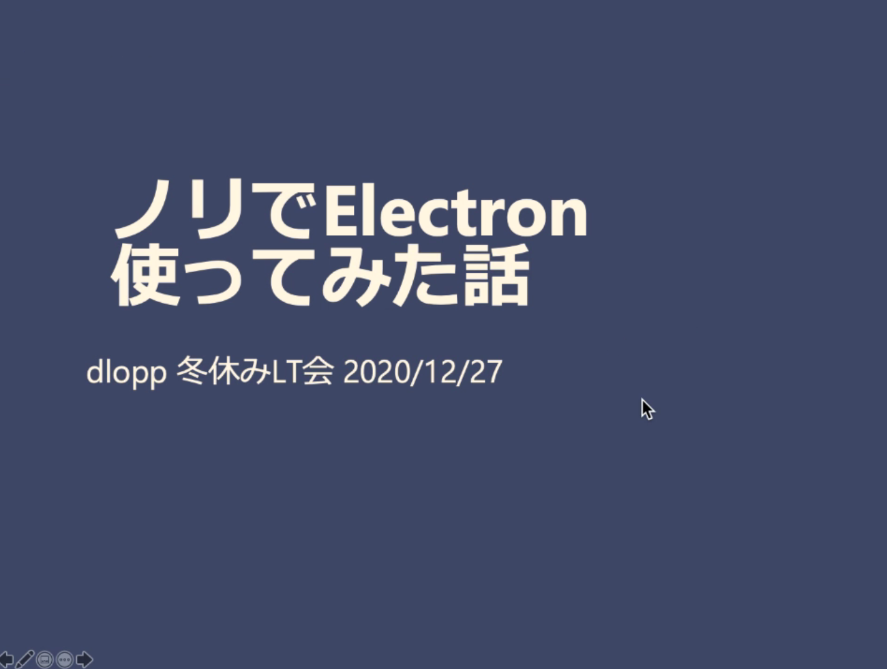

# 冬休みLT会   イベントレポート#2

明けましておめでとうございます！2021年1発目の記事は去年12/27(日)に行われた、冬休みLT会のイベントレポートです。  
dlopp運営の結土[(@yuto_wu)](https://twitter.com/yuto_wu)がお送りします！

### LT会って何？
LTとは　"Lightning Talks"　の略で、「稲妻のような短時間でなにか話してみよう！」というものです。  
簡単に言うと、短時間のプレゼンみたいなものですが、特にルールはありません。自分が思っていることや話したいことをまとめて話すという非常にシンプルなものなのです。
 

## 今回のテーマ
 

「最近やったこと」が今回のテーマでした。プログラミングに限らず何でも良し！です。メンバーが何をやっているのかを知るいい機会でしたので、親睦会みたいな雰囲気でした。

## タイムスケジュール
 

| 時間 | 内容 |
| ---- | ---- |
| 21:00 | 挨拶 |
| 21:05 | CommentScreenの説明＆登壇者の順番決め |
| 21:15 | 発表スタート |
| 22:30 | 終わり |
 
今回は７人の登壇者がいました。
 

| 名前 | 内容 |
| ---- | ---- |
| とぶ   | バイト先で電話対応がうまくなった話     |
| だいき | 本を読むことで生活リズムを取り戻した話 |
| ふじを | ノリでElectron使ってみた話             |
| miyuu  | ハッカソンに参加し、入賞した話         |
| yt     | node.jsを触ってみた、HP作ってみた話    |
| 結土   | Flutterでアプリ作ってる話              |
| mazda  | コードを安全に壊す技術                 |

## CommentScreen
[CommentScreen](https://commentscreen.com/)というものを導入しました。これは、専用のチャットルーム内で投稿されたチャットが登壇者のPC画面上に流れるというものです。ニコニコ動画みたいですね。 
これのおかげで、チャットでの反応がリアルタイムにできて、登壇者として非常にやりやすかったです。集まってできないこの世の中で、まるで一緒の場所にいるかのようなスムーズな反応ができました。

## LT会の様子
ここからは実際の様子のスクショで振り返ります。
 
 

ふむふむ。

 
 
顔マークとか良いねマークが出てますが、これが[CommentScreen](https://commentscreen.com/)です。テキストももちろん表示されます。

 

 
 
先輩の登壇。

 
 
製作中のアプリのデモを見せていただきました。Electronふむふむ...

 
 
外部ハッカソンに行ったメンバーです。デザインが見やすくて可愛くて良すぎるんです。

 
 
もうひとりの先輩です。非常にためになりました。

 
 
いつか挑戦してみたい。

 

## さいごに
ほとんどのメンバーが初めてのLT会で、私としても非常にワクワクしてました。私は話すことも聞くことも大好きなので、とても楽しめました！ 
先輩の方々の発表で新たな知見を得たり、外部イベントでの成果を発表したメンバーもいたり等、自分のモチベ向上や今後のためになる有用なイベントだったと思います。 
次のLT会のために頑張らなくてはっ！では！ 
 

今回参加して下さったメンバーのみなさん、有難うございました！ 
dloppでは、今後も様々なイベントを開こうと思ってます！そのほか、外部イベントにも参加していきたいと思います。  
普段は、好きに開発をして詰まった所を質問したりコードレビューもらったり、便利なツールを共有したりしています。  
dloppに興味を持って下さった方は、twitter[(@wucrea_dlopp)](https://twitter.com/wucrea_dlopp)からメッセージお待ちしております！
[aboutページ](../../about/index.md)も是非ご覧ください。